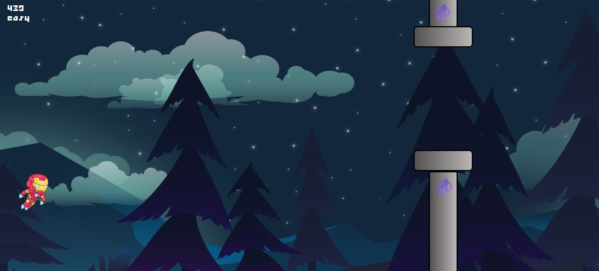
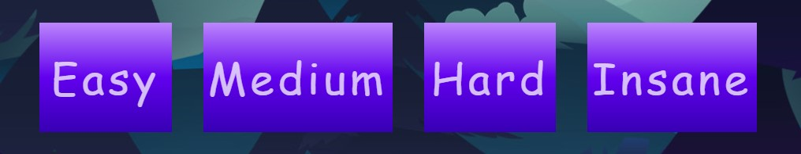
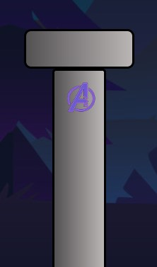
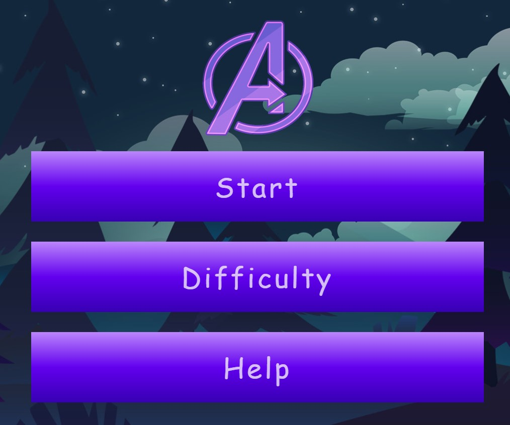

# The infinity Marathon

Join the avengers in their quest to save the universe, Thanos is trying to eleminate half of the universe, and it's your duty to stop that.

## Gameplay

You are able to play with Ironman or Thor, and your job is to avoid the obstacles that you face during your way into the infinity.

You can use **UP** and **DOWN** arrows to move, and there're four difficulties to choose from.

## Technicalilty

The implementation of the game is pure Javascript with no additional libraries.

### Level configurations

for each level, we configure it's speed and positing options in the `./js/config.js` file, you can change the speed and the distance you would like to allocate for the pipes in there.

### Characters

the `Character` class in `./js/Character.js` has all the functions nessecary for the character to move, get drawn on the screen.

### Game engine

the `game.js` is the game engine for the game, it handle game start, pipes movement, score updates and collision handling.

you can change any of the game rules in there.

### Pump

the pipe engine is in `Pump` class inside `./js/pump.js` which handles the creating of upper and lower pipes.

### Main menu

Main menu is handled via the `./js/index.js` file, which handles the choosing of character, difficulty and displaying help.

### Input handling 

inputs are handled in the `./js/Inputhandler.js`.

## Play online

You can play our game online using [this link](https://aliabdelaal.github.io/ITI-JS-Game/)

Enjoy the game.

